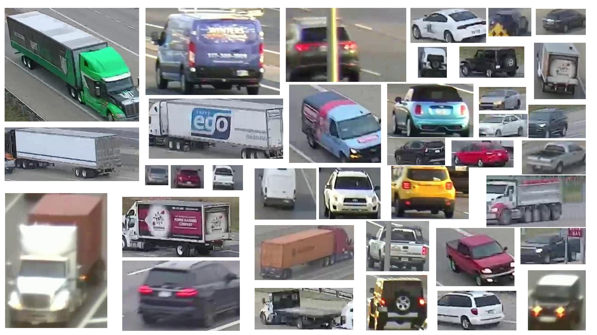
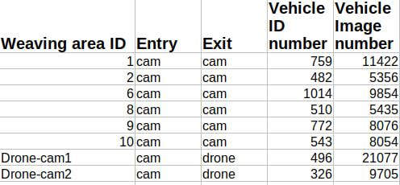

**************************************************************************************************************************************************
The VeID-Weaving dataset is collected from 6 weaving areas of Indiana Highways. This data was generated with 14 cameras and 2 drones. One weaving area is shown in Figure 1. Some vehicle examples in our data are shown in Figure 2. Specifically, for each weaving area, the unique vehicle number and image number are shown in Table 1.             A total of 4902 vehicles are annotated. 4576 vehicles are used for testing. The remaining 326 vehicles are for testing. There are 9705 images in the test set and 69274 images in the training set. If you use this dataset, please kindly cite our paper., This dataset should be used for research only. Please DO NOT distribute or use it for commercial use. 
*************************************************************************************************************************************************

Content in the directory:
1. "image_query/". This dir contains 970 images as queries.
2. "image_test/". This dir contains 9705 images for testing.
3. "image_train/". This dir contains 69274 images for training.
4. "name_query.txt". It lists all query file names.
5. "name_test.txt". It lists all test file names.
6. "name_train.txt". It lists all train file names.
10. "train_label.xml". It lists the labels, e.g., vehicle ID, camera ID of the training images.
11. "test_label.xml". It lists the labels of all test images.

Figure 1:

Figure 2:

Table 1:

If you have any problem, please contact meiqiu@iu.edu; https://qiumei1101.github.io/

Citation:
@article{qiu2024enhancing,
  title={Enhancing Vehicle Re-identification and Matching for Weaving Analysis},
  author={Qiu, Mei and Lin, Wei and Chien, Stanley and Christopher, Lauren and Chen, Yaobin and Hu, Shu},
  journal={arXiv preprint arXiv:2407.04688},
  year={2024}
}
